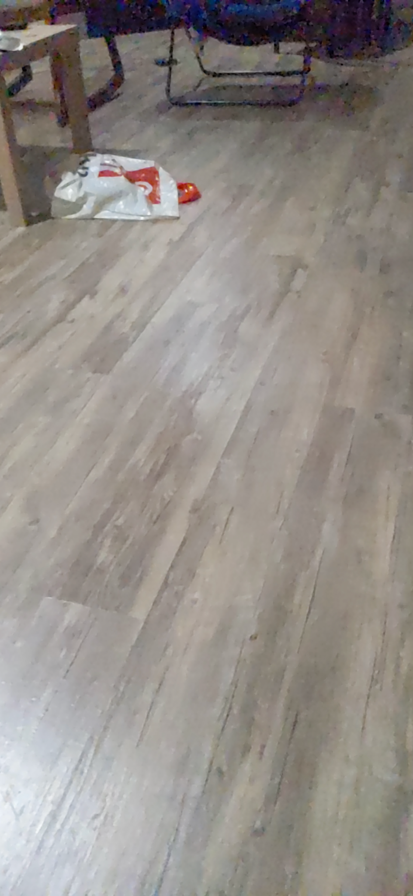
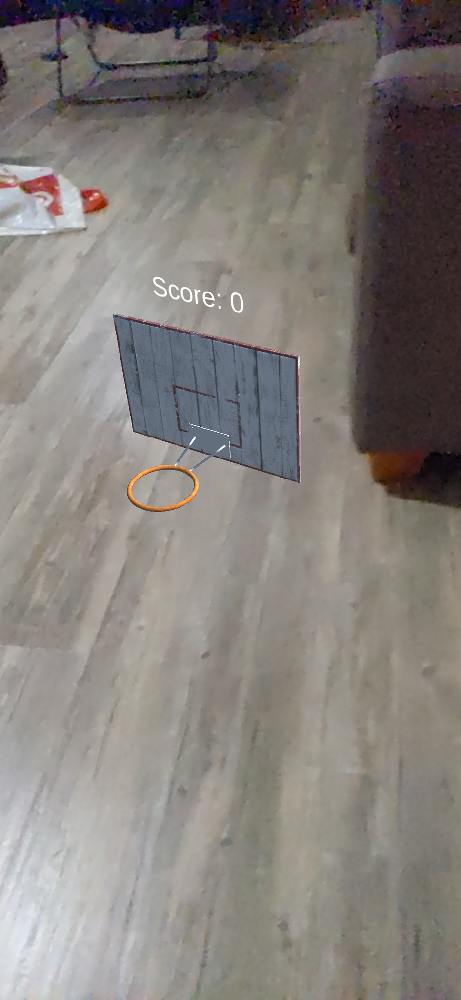
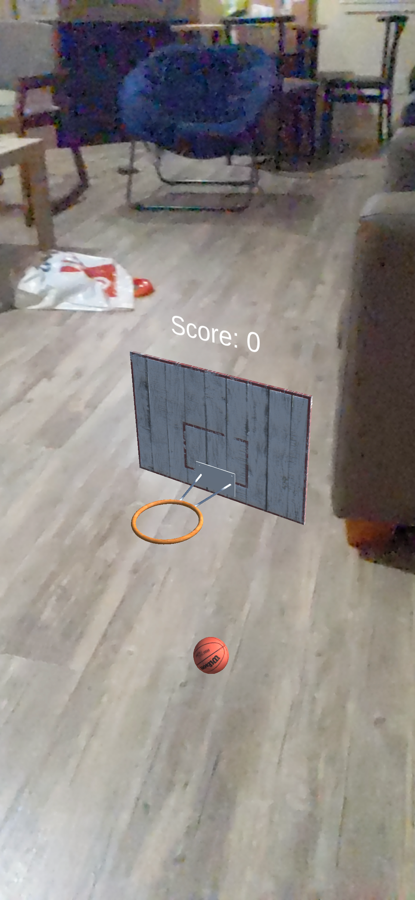
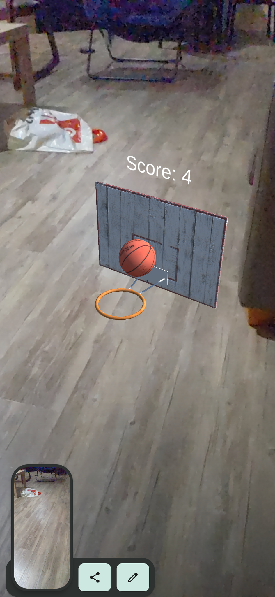

# ballAR

### Overview

The goal of this project is to provide an interactive AR experience for shooting hoops in basketball for 
players on the go. Players can start a game anywhere as long as they find a surface. Once found, tap once
to generate a basketball hoop. The next taps will allow the user to shoot a ball, with each made basket
awarding 1 point. After 6 points, the game becomes harder as the basket will start moving rapidly back
and forth. 
The purpose of this application will be its ease of use. 
Users will just need to find a flat floor and the game can begin!

For the Milestone, I plan to have a working implementation of the basketball and hoop finished. 

Demo Video
https://www.youtube.com/watch?v=Cb50QmgxAiY

### Methods and Limitations
This project was developed and tested for Android via Unity. Assets were obtained from the Unity asset store
and Sketchfab (all free). No additional APIs were used for the game. There are a couple limitations to this
simplified game. First, it is not possible to adjust the aim of the ball with just a finger. The camera and 
phone must be positioned correctly to properly aim. The other main issue is that sometimes there is a bug 
with the touchscreen as can be seen in the demo. This causes the ball to shoot much higher than intended. 
Otherwise, the game works very well. 

Images:

Milestone Progress: Hoop and Ball can be generated, ball can be shot toward hoop. 
TODO: add score keeping by adding a collider, make hoop moving.